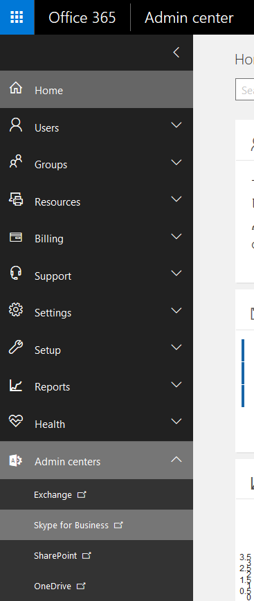
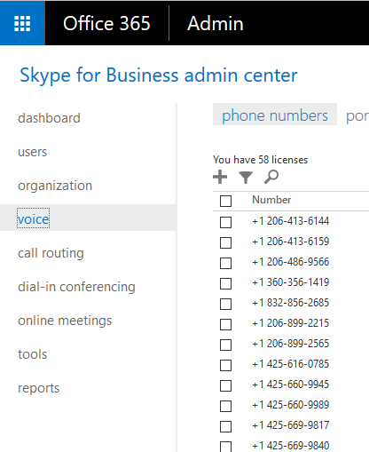
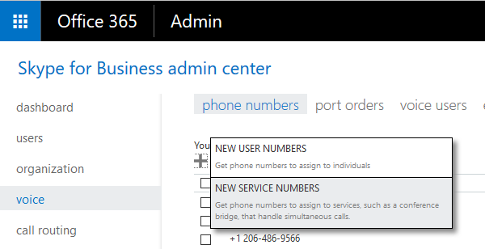
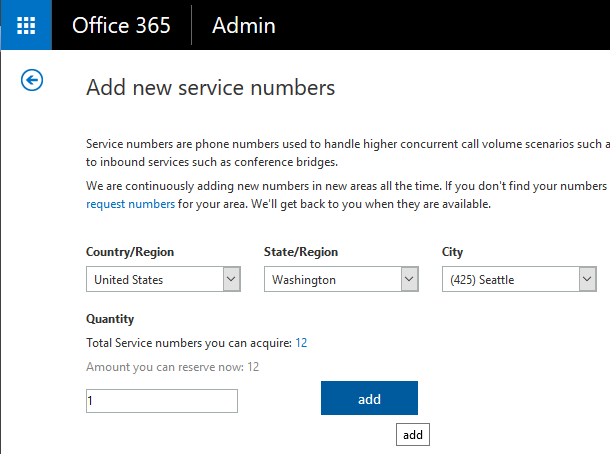
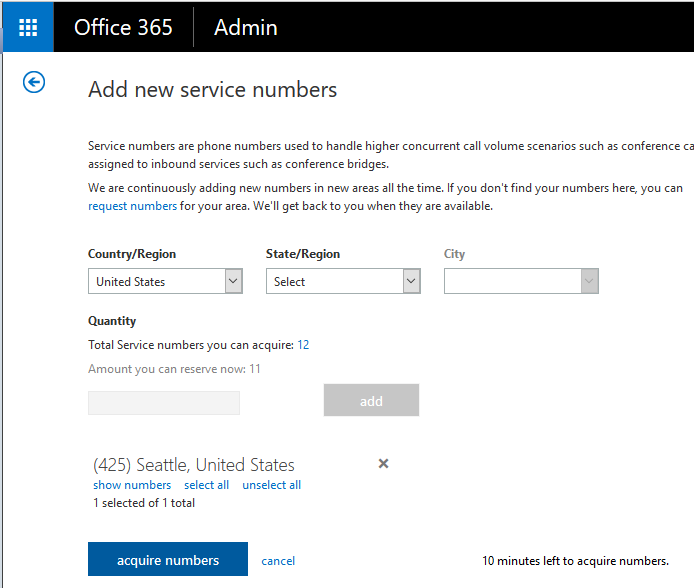

 ## Acquire the service phone number
 
 This section will help you aquire a service phone number. The service phone number is assigned to the service application's endpoint for receiving the incoming calls from the PSTN.

 Please refer [Setting up a Trusted Application Endpoint](https://github.com/OfficeDev/skype-docs/blob/master/Skype/Trusted-Application-API/docs/TrustedApplicationEndpoint.md) for more detail on assigning the service phone number to the service application's trusted endpoints.
 
## Getting the service phone number

1. Go to [Office 365 admin center](https://portal.office.com/adminportal/home).
2. Sign in using the tenant credentials. 
3. Click the **Admin Centers** tab in the left  column and select **Skype for Business** option.
  
  

4. In left column, select **Voice** -> **Phone Numbers**

  

5. Click **+** button at the top and then select **New Service Numbers** to add a new service phone number.

  

6. Fill in all the required information and click **add**

  

7. Now click **acquire numbers** to confirm.

  

8. Once you acquire the service number by following the above mentioned steps, It will be added to the list of the**[Phone Numbers](https://admin0a.online.lync.com/LSCP/Voice.aspx)**.

  

9. Go throught this **Phone Numbers** list and find the phone number that is **Unassigned** and has **Number Type as Service**. This is the phone number that you will assign to the service application's endpoint and anyone can call this number to reach the application. 

